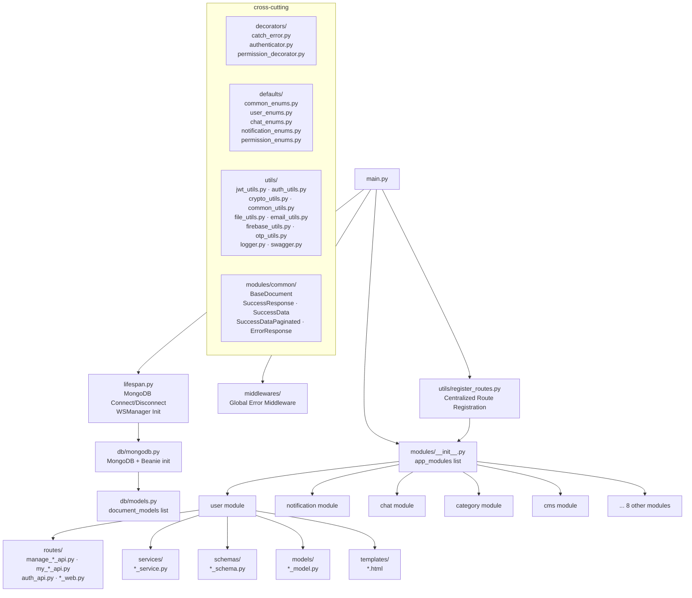

# 🏗️ AGENT.md — Prime Directive

> **Fast Date** · FastAPI · MongoDB · Python 3.10+

---

## 🧰 Tech Stack & Core Dependencies

| Layer                    | Technology                    | Version                     |
| ------------------------ | ----------------------------- | --------------------------- |
| **Framework**            | FastAPI                       | `>=0.104.0,<0.105.0`        |
| **ASGI Server**          | Uvicorn (standard)            | `>=0.24.0,<0.25.0`          |
| **ODM (Database)**       | Beanie (MongoDB)              | `^2.0.1`                    |
| **Database Driver**      | Motor (async) + PyMongo       | `motor^3.3`, `pymongo>=4.6` |
| **Validation / Schemas** | Pydantic v2                   | `^2.12.5`                   |
| **Authentication**       | PyJWT + Argon2-cffi           | `^2.10.1`, `^25.1.0`        |
| **Templating**           | Jinja2                        | `^3.1.6`                    |
| **File Storage**         | Boto3 / aiobotocore (AWS S3)  | `1.42.5`                    |
| **Push Notifications**   | Firebase Admin SDK            | `^7.1.0`                    |
| **Static Typing**        | Mypy + Pydantic mypy plugin   | `^1.19.0`                   |
| **Linter / Formatter**   | Ruff                          | `^0.14.9`                   |
| **Dependency Mgmt**      | Poetry                        | —                           |
| **Real-time**            | WebSockets (FastAPI built-in) | —                           |

---

## 🗺️ High-Level Architectural Map

### Where Things Live

| Location                                      | Purpose                                                                              |
| --------------------------------------------- | ------------------------------------------------------------------------------------ |
| `fast_app/main.py`         | FastAPI app factory — CORS, middleware, route registration, static files             |
| `fast_app/lifespan.py`     | Startup/shutdown: MongoDB connect + Beanie init, WSManager init                      |
| `fast_app/db/mongodb.py`   | `MongoDB` class — `connect()` / `close()`, calls `init_beanie`                       |
| `fast_app/db/models.py`    | **Central `document_models` list** — every Beanie `Document` must be registered here |
| `fast_app/modules/`        | All domain modules (user, notification, chat, category, cms, etc.)                   |
| `fast_app/modules/common/` | `BaseDocument`, `SuccessResponse`, `SuccessData`, `SuccessDataPaginated`, `ErrorResponse` |
| `fast_app/modules/demo/`   | **Canonical scaffold module — the single source of truth for module structure**      |
| `fast_app/decorators/`     | `@catch_error`, `@login_required`, `@action_type` — mandatory patterns on routes     |
| `fast_app/defaults/`       | Shared Enums — `UserRole`, `StatusEnum`, `OtpPurpose`, `Resource`, `Action`, etc.    |
| `fast_app/utils/`          | Cross-cutting utilities: JWT, auth, crypto, file upload, email, Firebase, OTP, logger |
| `fast_app/core/`           | Core shared infrastructure (WebSocket manager, etc.)                                 |
| `fast_app/commands/`       | CLI scaffolding scripts (`create-module`, `create-form-module`, `create-cms-module`) |
| `fast_app/static/`         | Global static assets served at `/static`                                             |

---

## 🧠 Philosophy of Implementation

> **"Module-first. Demo-driven. Decorator-enforced."**

1. **Module-First Architecture**: Every domain object lives in its own module directory. Cross-module imports are forbidden except for `modules/common`, `decorators`, `defaults`, and `utils`.

2. **Demo is the Canonical Scaffold**: The `modules/demo` module is the single reference implementation. When in doubt about structure, look at `demo`. New modules are created by scaffolding from `demo` via the `poetry run create-module <name>` CLI — not by hand.

3. **Decorator-Enforced Safety**: Every API route handler **must** be decorated with `@catch_error`. Every protected route **must** also use `@login_required(*roles)`. There are no raw try/except blocks inside route handlers.

4. **Service Layer Isolation**: Route handlers are thin orchestrators. Business logic lives exclusively in `*_service.py`. Routes accept schemas and call service functions — never query the database directly.

5. **Pydantic-first Validation**: All input validation happens via Pydantic v2 schemas. Never validate manually in service layers or route handlers.

6. **Beanie ODM Only**: Database access is exclusively through Beanie Document models. Raw PyMongo queries are only used inside `BaseDocument` aggregate helpers. Never import `motor` directly in application code.

7. **Enums in `defaults/`**: All `str, Enum` types shared across modules live in `fast_app/defaults/`. Module-scoped enums that are only used within one module may live in that module's schemas file.

---

## 🤖 Persistent Sub-Agents

### 🎨 [UI Architect]

**Domain**: Jinja2 templates, admin web routes, HTML/CSS/Bootstrap consistency.

- Ensures every web route uses `ChoiceLoader` with `admin_layout.html` as the base layout.
- Enforces ``, ``, and `` structure in all templates.
- Ensures all forms POST to meaningful URLs and display error context via `{{ error }}`.
- Prohibits inline styles. Bootstrap 5 utility classes only.

### ⚙️ [Logic Engine]

**Domain**: Service layers, Beanie ODM queries, JWT auth, OTP flows, S3 uploads, RBAC.

- Enforces that `*_service.py` files contain **all** business logic — routes are thin wrappers.
- Validates that all Beanie query operations check `is_deleted == False` where applicable.
- Ensures JWT token creation (`create_access_token`) and session tracking (`UserDevice`) follow the established `admin_auth_service` pattern.
- Validates that file uploads always go through `utils/file_utils.py`, never directly to S3.
- Enforces OTP flows use `utils/otp_utils.py` and respect the `OtpPurpose` enum.
- Ensures new Beanie Document models are registered in `fast_app/db/models.py` → `document_models` list.
- Enforces RBAC-sensitive admin routes use `@action_type` from `permission_decorator.py` alongside `@login_required(UserRole.ADMIN)` and declare `__resource__` on the router.

### 🛡️ [Type Guardian]

**Domain**: Mypy compliance, Pydantic models, return type annotations.

- Enforces `-> dict`, `-> Dict[str, Any]`, or Pydantic model return types on all service functions.
- Ensures `model.model_dump(by_alias=True, mode="json")` is used when serializing Beanie documents to JSON.
- Flags any function without a return type annotation in non-demo/test modules.
- Mypy is configured with `warn_return_any = true` — returning untyped values from typed functions is forbidden.
- The `# type: ignore[attr-defined]` comment is acceptable only in `BaseDocument` aggregate helpers where Beanie's dynamic signature is the known limitation.
